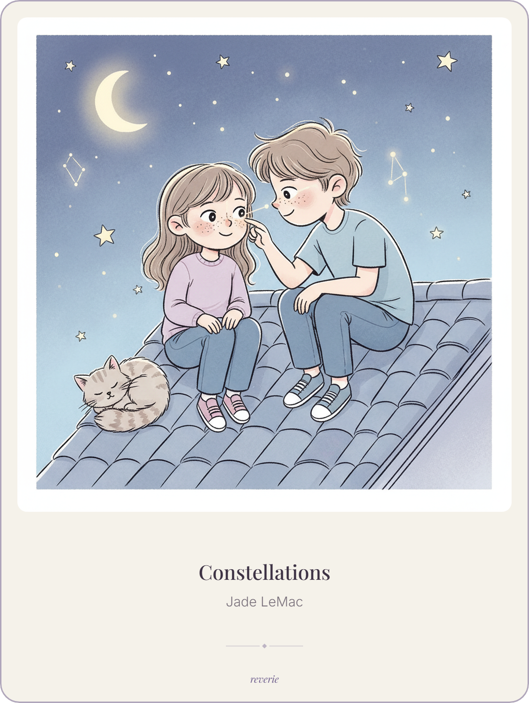
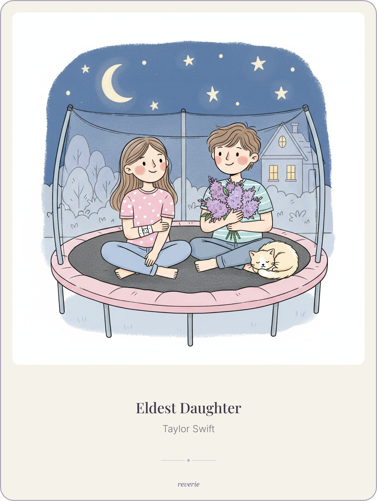
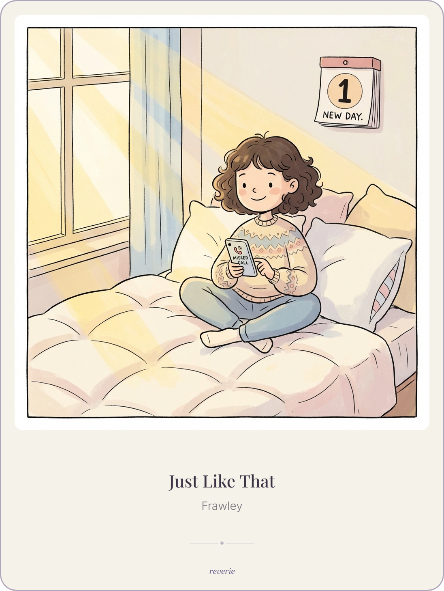

# Reverie

Turn songs into generate images. Input a Spotify link and Reverie creates a storybook style image based on the song's lyrics and mood. (keep an eye out for the tiny cat Easter egg 🐱)

## Setup

### 1. Environment

```bash
cp .env.example .env
```

Fill in your API keys in `.env`. At minimum you need one LLM provider and one image provider


### 2. Backend

Requires Python 3.12+

```bash
pip install -e .
uvicorn backend.main:app --reload
```

### 3. Frontend

```bash
cd frontend
npm install
npm run dev
```

The app runs at `http://localhost:5173`.

## How It Works

1. You provide a song (name + artist, lyrics, or Spotify URL)
2. The backend fetches metadata and lyrics
3. An LLM analyzes the song and writes a visual prompt
4. An image model generates art from that prompt
5. The result is displayed in the browser

## Providers

LLM and image providers are swappable via `.env` — no code changes needed.

**LLM:** OpenAI
**Image:** Gemini, OpenAI

(the DALLE-generated images are all photorealistic and I don't like any of them, so I recommend Gemini for best results)

## Samples

| Constellations — Jade LeMac | Eldest Daughter — Taylor Swift | Just Like That — Frawley |
|:---:|:---:|:---:|
|  |  |  |
